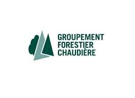
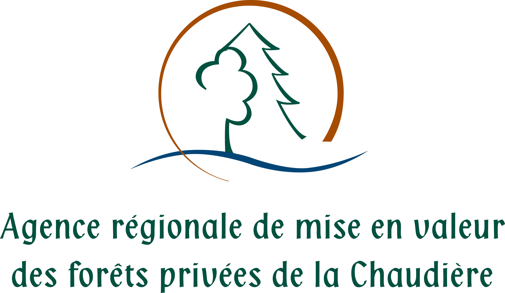

# Nos essences forestières vers le futur 

## Le projet intial
Ces fiches ont été réalisées dans le cadre du projet "Documentation des bonnes pratiques pour le reboisement d'essences feuillues dans un contexte de changements climatiques et de pression de broutement".
Elles font le bilan, par espèce, des connaissances scientifiques les plus à jour vis-à-vis de leur vulnérabilité aux changements climatiques. 
Ces fiches sont un complément aux connaissances actuelles des professionnels forestiers. 

## Les fiches
### Chaudière-Appalache | Centre-du-Québec | Montérégie | Estrie
##### *Version 1.3 - Dernière mise-à-jour de la page : 2024-09-16* 

Voici les fiches PDF présentement disponibles. Cliquez sur les liens pour lancer le téléchargement des PDF.   
Pour plus d'informations concernant les fiches, vous pouvez contacter : [Marine Duperat](mailto:mduperat@cerfo.qc.ca) ou [Samuel Royer-Tardif](mailto:sroyertardif@cerfo.qc.ca)

**Feuillus**
* [Bouleau gris](./BOG_v1.3.pdf)  
* [Bouleau jaune](./BOJ_vf1.3.pdf)  
* [Caryer cordiforme](./CAC_v1f.3.pdf)  
* [Caryer ovale](./CAF_vf1.3.pdf)  
* [Cerisier tardif](./CET_vf1.3.pdf)  
* [Chêne blanc](./CHB_vf1.3.pdf)  
* [Chêne bicolore](./CHE_vf1.3.pdf)  
* [Chêne à gros fruits](./CHG_vf1.3.pdf)  
* [Chêne rouge](./CHR_vf1.3.pdf)  
* [Érable argenté](./ERA_vf1.3.pdf)
* [Érable noir](./ERN_v1.3.pdf)
* [Érable rouge](./ERR_vf1.3.pdf)
* [Érable à sucre](./ERS_vf1.3.pdf)
* [Micocoulier occidental](./CEO_v1.3.pdf)  
* [Noyer noir](./NON_vf1.3.pdf)
* [Ostryer de Virginie](./OSV_v1.3.pdf)
* [Peuplier deltoïde](./PED_v1.3.pdf)
* [Peuplier à grandes-dents](./PEG_vf1.3.pdf)
* [Peuplier faux-trembles](./PET_v1.3.pdf)
* [Tilleul d'Amérique](./TIL_vf1.3.pdf)  

**Conifères**
* [Pin blanc](./PIB_v1.3.pdf)
* [Pin Rouge](./PIR_v1.3.pdf)
* [Pruche](./PRU_vf1.3.pdf)
* [Thuya occiental](./THO_v1.3.pdf)

## Partenariat et financements
 
 
 
